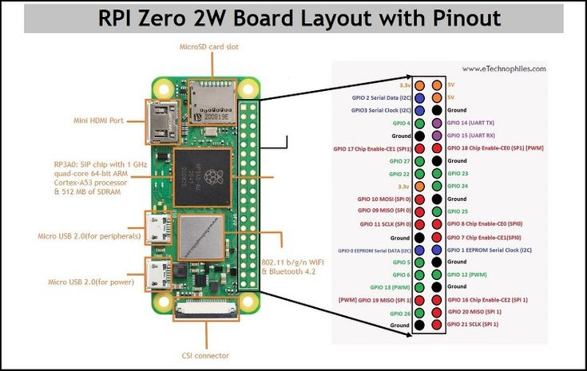

#Bosmuseum

### This project is written in Dutch as part of my efforts to learn the language.

## Projecten met lage-vermogen systemen voor het onthaal en evenementen van het Bosmuseum.

Deze projecten maken gebruik van een Raspberry Pi Zero 2W, gekocht [hier](https://www.amazon.com.be/-/en/GeeekPi-Raspberry-Starter-Preloaded-Heatsink/dp/B0B7MR7XWT?source=ps-sl-shoppingads-lpcontext&ref_=fplfs&ref_=fplfs&psc=1&smid=A187Y4UVM6ZA0X&gQT=2). Het was gekozen omdat het een HDMI poort heeft om een automatisch ppt te tonen, een camera poort om te filmen met een camera, en ook I/O pins heeft zodat we ook knoppen en lichten aan de pi kunnen hebben.

Het Schatten van Vlieg project gebruikt de [DFPlayer Mini](https://www.az-delivery.de/en/products/mp3-player-modul?variant=8198615662688) in plaats van een Raspberry Pi Zero 2W (RPI02W). 

## Samenvatting

Deze repository is voor de code en uitleg voor projecten te maken met de van Bosmuseum Jan van Ruusbroec.

Deze repository is gedeeld in 3 secties, een automatisch powerpoint voor het onthaal, een toestel die geluid zou maken als je op een knop drukt, en ook en camera toestel waar een film naar een web server wordt gestuurd. 
