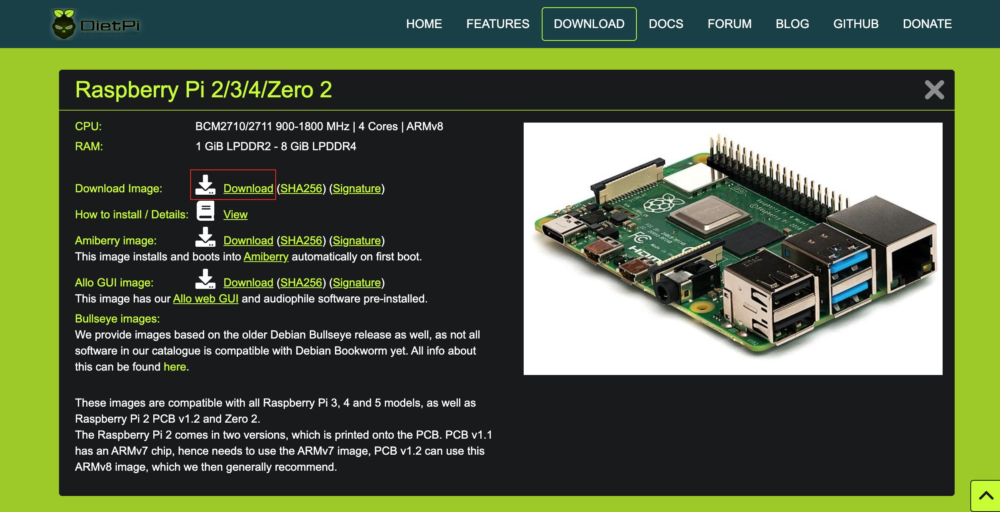
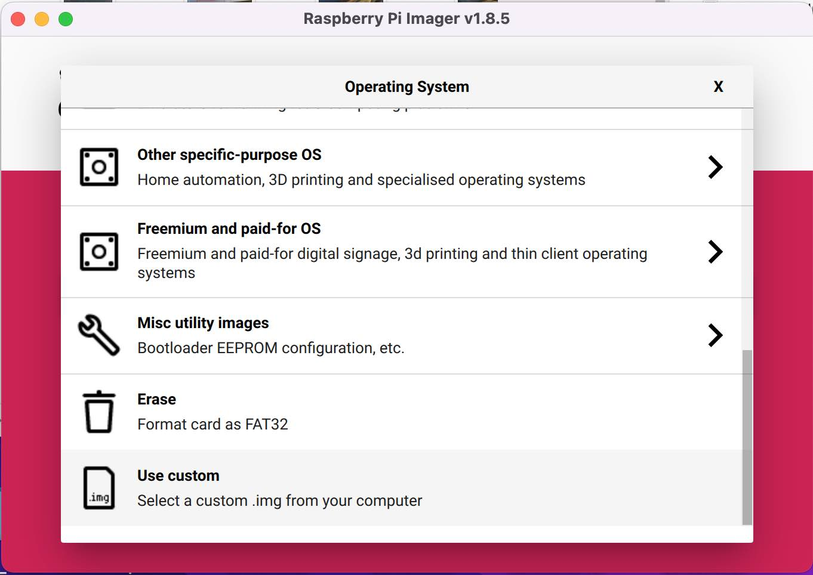
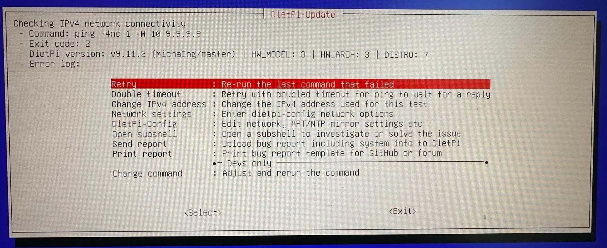
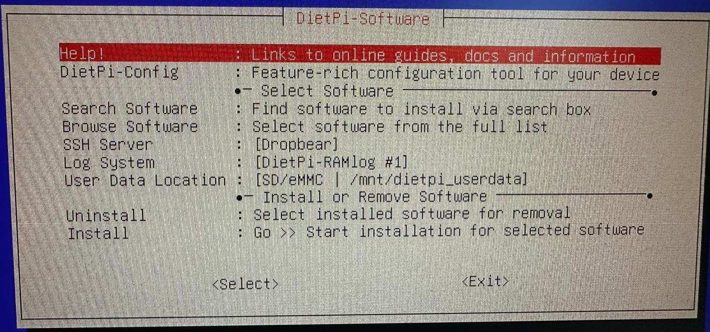
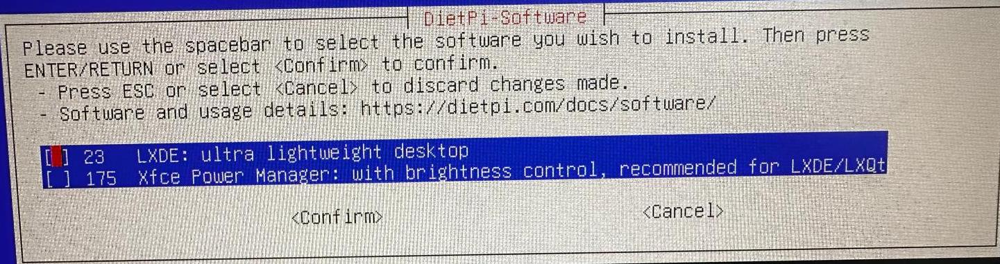

# Automatisch PPT

## Installeren van DietPi OS

DietPi is een "lightweight" OS dat sneller runt dan de normale RPI OS. Om het te installeren moet je toegang hebben tot een andere computer om RPI Imager te installeren en gebruiken.

### Flashen op een andere Computer

Eerst download [RPI imager](https://www.raspberrypi.com/software/) voor uw operating systeem. Start het op en steek de MicroSD kaart in de computer. 

Ga naar de [DietPi Website](https://dietpi.com/#downloadinfo) en neem de download die aangeduid is. Expand het van .img.xz naar .img.  



In RPI Imager, ga naar "custom" en zoek naar je .img bestand. 



Klik op "Edit Settings" nadat je je SD kaart hebt geselecteerd. 


Ga dan ook naar SERVICES -> Enable SSH (met wachtwoord). Dan klik `SAVE` en `YES`. DietPi wordt geinstalleerd op je SD kaart, en dan kan het in de RPI02W.


### RPI02W Setup

Volg de foto om alles te verbinden met de RPI. Steek de power kabel laatst in zodat je alles zal zien op het scherm. 


### RPI02W Eerste Opstart

Ga door de stappen van DietPi op te zetten op de computer. Het kan zijn dat je manueel met de WiFi moet verbinden - als de WiFi niet lukt, zal je zo een scherm krijgen: 



Dan ga je naar `Network Settings`, dan naar `WiFi`, `Scan`, `0: [Unused] Select to configure`, `Scan`, `{WIFI_NAAM}`, `{WWD_TYP}`, en typ het wachtwoord in. 

Nu kan je terug naar het WiFi menu gaan (met `esc`), verander de `Country` naar `BE`, en selecteer `Save all changes and restart networking`. Als dit lukt, zal je IP-adres veranderen van 0.0.0.0. Ga terug naar het menu van de vorige afbeelding en selecteer `Retry`. 

Aan het einde zal je op de console komen, want er is nog geen GUI geinstalleerd. Log in met de username en wachtwoord boven op het scherm. 

Selecteer `Generic 105-key PC`. Selecteer `Other` en `Belgian` als je een AZERTY toetsenbord hebt. 

Klik de default option voor de meeste dingen. Klik `cancel` op beide wachtwoorden veranderen. 

Disable UART. 

Nu kom je op het software install menu. Hier installeren we LXDE, onze GUI. Ga naar `Search software` en typ LXDE. 



Gebruik de spacebar om het te selecteren van de lijst, en dan confirm (enter). Dan selecteer `Install`.  



Je moet geen web browser installeren. Ga naar `dietpi-launcher`, `DietPi-Config`, `Autostart Options` en selecteer `Automatic login` in de `Desktops`. `dietpi` moet de user zijn. 

Nadat de install gedaan is, `reboot`. 

### Remote verbinden met RPI

Je kan het command line van de RPI op je eigen computer gebruiken. Dit doe je via SSH verbinding. Doe eerst een terminal open op de RPI en noteer het IP-adres van het menu bovenaan. 

Dan verbinden via SSH in een terminal op je eigen computer: 

```
ssh dietpi@192.168.0.100
```

Wachtwoord is dietpi, of iets anders als je het veranderd hebt. 

## Installeren van LibreOffice

LibreOffice is een sneller versie van MicrosoftOffice, gemaakt voor Linux devices. Typ de volgende commando in de LXTerminal om het te installeren. 

```
sudo apt install libreoffice
```

## Veranderen van achtergrond

```
pcmanfm --set-wallpaper="/your/background/file"
```

## Clonen van deze repository op de raspberry pi

Maak een SSH key aan. 

```
ls -al ~/.ssh

ssh-keygen -t ed25519 -C "your_email@example.com"
eval "$(ssh-agent -s)"
ssh-add ~/.ssh/id_ed25519
cat ~/.ssh/id_ed25519.pub  # paste this into GitHub settings

sudo apt install git

git config --global user.name "Your Name"
git config --global user.email "your_email@example.com"

git clone git@github.com:OliverSchamp/bosmuseum_onthaal.git
```

In de toekomst wil ik veel van de bash commandos hier samen in een file zetten die je dan gewoon kan runnen na de clonen van de repo. 

## Downloaden van presentatie

De presentatie link heb je ergens. Dit gebruik je om de presentatie te downloaden.

```
curl -L "https://docs.google.com/presentation/d/<GOOGLE_DOC_ID>/export/odp" -o /path/to/output_file.odp
```

## Veranderingen aan ppt zodat het automatisch speelt. 

Hier moeten wij iets in code schrijven... maar voordien maken dat een knop de ppt download op de pi. 

## Opzetten van automatisch service met script en .service bestand. 

## Commandos die worden uitgevoerd om zeker te maken dat de ppt aan het runnen is. 

## Maken van circuit met knop om een nieuwe ppt te downloaden van google docs. 

Misschien ook leds voor gelukt of niet gelukt. 

## Programmeren van file voor I/O. 

## Stoppen van de automatisch ppt en de trekken van de nieuwe ppt van de google docs. 