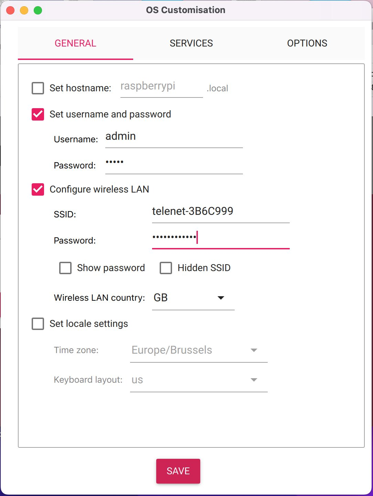
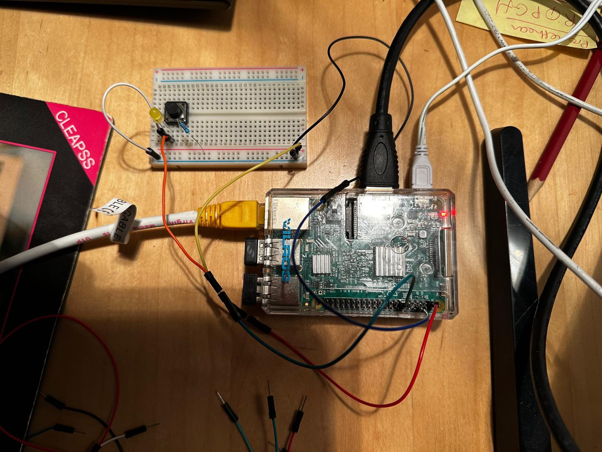

# Automatisch PPT

## Installeren van DietPi OS

DietPi is een "lightweight" OS dat sneller runt dan de normale RPI OS. Om het te installeren moet je toegang hebben tot een andere computer om RPI Imager te installeren en gebruiken.

### Flashen op een andere Computer

Eerst download [RPI imager](https://www.raspberrypi.com/software/) voor uw operating systeem. Start het op en steek de MicroSD kaart in de computer. 

Ga naar de [DietPi Website](https://dietpi.com/#downloadinfo) en neem de download die aangeduid is. Expand het van .img.xz naar .img.  


In RPI Imager, ga naar "custom" en zoek naar je .img bestand. 


Klik op "Edit Settings" nadat je je SD kaart hebt geselecteerd. 



Ga dan ook naar SERVICES -> Enable SSH (met wachtwoord). Dan klik `SAVE` en `YES`. DietPi wordt geinstalleerd op je SD kaart, en dan kan het in de RPI02W.


### RPI02W Setup

Volg de foto om alles te verbinden met de RPI. Steek de power kabel laatst in zodat je alles zal zien op het scherm. 


### RPI02W Eerste Opstart

Ga door de stappen van DietPi op te zetten op de computer. Het kan zijn dat je manueel met de WiFi moet verbinden - als de WiFi niet lukt, zal je zo een scherm krijgen: 


Dan ga je naar `Network Settings`, dan naar `WiFi`, `Scan`, `0: [Unused] Select to configure`, `Scan`, `{WIFI_NAAM}`, `{WWD_TYP}`, en typ het wachtwoord in. 

Nu kan je terug naar het WiFi menu gaan (met `esc`), verander de `Country` naar `BE`, en selecteer `Save all changes and restart networking`. Als dit lukt, zal je IP-adres veranderen van 0.0.0.0. Ga terug naar het menu van de vorige afbeelding en selecteer `Retry`. 

Aan het einde zal je op de console komen, want er is nog geen GUI geinstalleerd. Log in met de username en wachtwoord boven op het scherm. 

Selecteer `Generic 105-key PC`. Selecteer `Other` en `Belgian` als je een AZERTY toetsenbord hebt. 

Klik de default option voor de meeste dingen. Klik `cancel` op beide wachtwoorden veranderen. 

Disable UART. 

Nu kom je op het software install menu. Hier installeren we LXDE, onze GUI. Ga naar `Search software` en typ LXDE. 


Gebruik de spacebar om het te selecteren van de lijst, en dan confirm (enter). Dan selecteer `Install`.  


Je moet geen web browser installeren. Ga naar `dietpi-launcher`, `DietPi-Config`, `Autostart Options` en selecteer `Automatic login` in de `Desktops`. `root` moet de user zijn. 

Dan `sudo nano /etc/systemd/system/getty@tty1.service.d/dietpi-autologin.conf` en verander van root naar dietpi. 

Nadat de install gedaan is, `reboot`. 

Ook omdat het traag opstart:

```
AUTO_SETUP_BOOT_WAIT_FOR_NETWORK=0

CONFIG_NTP_MODE=0
```

### Remote verbinden met RPI

Je kan het command line van de RPI op je eigen computer gebruiken. Dit doe je via SSH verbinding. Doe eerst een terminal open op de RPI en noteer het IP-adres van het menu bovenaan. 

Dan verbinden via SSH in een terminal op je eigen computer: 

```
ssh dietpi@192.168.0.100
```

Wachtwoord is dietpi, of iets anders als je het veranderd hebt. 

## Installeren van LibreOffice

LibreOffice is een sneller versie van MicrosoftOffice, gemaakt voor Linux devices. Typ de volgende commando in de LXTerminal om het te installeren. 

```
sudo apt install libreoffice -y
sudo apt install libreoffice-gtk3 libxrender1 libfontconfig1 libdbus-glib-1-2 -y

```

## Veranderen van achtergrond

```
pcmanfm --set-wallpaper="/your/background/file"
```

## Clonen van deze repository op de raspberry pi

Maak een SSH key aan. 

```
ls -al ~/.ssh

ssh-keygen -t ed25519 -C "your_email@example.com"
eval "$(ssh-agent -s)"
ssh-add ~/.ssh/id_ed25519
cat ~/.ssh/id_ed25519.pub  # paste this into GitHub settings

sudo apt install git

git config --global user.name "Your Name"
git config --global user.email "your_email@example.com"

git clone git@github.com:OliverSchamp/bosmuseum_onthaal.git
```

In de toekomst wil ik veel van de bash commandos hier samen in een file zetten die je dan gewoon kan runnen na de clonen van de repo. 

## Downloaden van presentatie

De presentatie link heb je ergens. Dit gebruik je om de presentatie te downloaden.

```
curl -L "https://docs.google.com/presentation/d/<GOOGLE_DOC_ID>/export/odp" -o /path/to/output_file.odp
```

Maar hier moet je eerst authenticaten. Ga naar [google cloud console](console.cloud.google.com). Maak een nieuw project aan. 

To download a Google Doc using `curl` with OAuth 2.0 authentication from the command line, you need to obtain an access token and include it in your `curl` request. Google Docs requires OAuth 2.0 for authentication when accessing private documents programmatically. Below is a step-by-step guide to authenticate and download the file: 

### Step 1: Set Up OAuth 2.0 Credentials
1. **Go to the Google Cloud Console**:
   - Navigate to [console.cloud.google.com](https://console.cloud.google.com).
   - Create a new project or select an existing one.

2. **Enable the Google Drive API**:
   - Go to "APIs & Services" > "Library."
   - Search for "Google Drive API" and enable it.

3. **Create OAuth 2.0 Credentials**:
   - Go to "APIs & Services" > "Credentials."
   - Click "Create Credentials" > "OAuth 2.0 Client IDs."
   - Select "Desktop app" as the application type (since you're using the command line).
   - Name your client and click "Create."
   - Download the JSON file containing your `client_id` and `client_secret`.

4. **Note the Redirect URI**:
   - For command-line usage, Google historically supported `urn:ietf:wg:oauth:2.0:oob` as a redirect URI, but this is now deprecated. Instead, use `http://localhost` or `http://127.0.0.1` and manually handle the authorization code.

### Step 2: Get an Authorization Code
1. **Construct the Authorization URL**:
   Replace `<CLIENT_ID>` and `<SCOPE>` in the following URL with your values:
   ```
   https://accounts.google.com/o/oauth2/v2/auth?client_id=<CLIENT_ID>&redirect_uri=http://127.0.0.1&scope=<SCOPE>&response_type=code&access_type=offline
   ```
   - `<CLIENT_ID>`: From the JSON file.
   - `<SCOPE>`: Use `https://www.googleapis.com/auth/drive.readonly` for read-only access to Google Drive (which includes Docs).
   - `access_type=offline` ensures you get a refresh token (optional but useful).

2. **Open the URL in a Browser**:
   - Paste the URL into a browser where you're logged into your Google account.
   - Approve the permissions.
   - The browser will redirect to `http://127.0.0.1` with a `code` parameter in the URL (e.g., `http://127.0.0.1/?code=4/0AX...`). Copy this code. If you see a "This site can’t be reached" error, that's fine—just grab the code from the address bar.

### Step 3: Exchange the Authorization Code for an Access Token
1. **Use `curl` to Get the Token**:
   Run the following command, replacing `<CLIENT_ID>`, `<CLIENT_SECRET>`, and `<CODE>` with your values:
   ```
   curl -X POST \
   -d "code=<CODE>&client_id=<CLIENT_ID>&client_secret=<CLIENT_SECRET>&redirect_uri=http://127.0.0.1&grant_type=authorization_code" \
   https://oauth2.googleapis.com/token
   ```
   - `<CODE>`: The code from the browser URL.
   - `<CLIENT_SECRET>`: From the JSON file.

2. **Response**:
   You’ll receive a JSON response like this:
   ```
   {
     "access_token": "ya29...",
     "expires_in": 3599,
     "refresh_token": "1//...",
     "scope": "https://www.googleapis.com/auth/drive.readonly",
     "token_type": "Bearer"
   }
   ```
   Save the `access_token` (and optionally the `refresh_token` for later use).

### Step 4: Download the Google Doc with `curl`
1. **Get the File ID**:
   - Open the Google Doc in your browser. The URL will look like `https://docs.google.com/document/d/<FILE_ID>/edit`. Copy the `<FILE_ID>`.

2. **Use `curl` to Download**:
   Use the access token in the `Authorization` header to download the file. Google Docs can be exported in various formats (e.g., PDF, DOCX). For example, to download as a PDF:
   ```
   curl -L -H "Authorization: Bearer <ACCESS_TOKEN>" \
   "https://www.googleapis.com/drive/v3/files/<FILE_ID>/export?mimeType=application/pdf" \
   -o output.pdf
   ```
   - `<ACCESS_TOKEN>`: The token from Step 3.
   - `<FILE_ID>`: The ID from the URL.
   - `mimeType`: Options include `application/pdf`, `application/vnd.openxmlformats-officedocument.wordprocessingml.document` (DOCX), `text/plain`, etc.
   - `-o output.pdf`: Saves the file as `output.pdf`.

### Notes
- **Token Expiration**: The access token expires in about 1 hour (3599 seconds). Use the refresh token to get a new one if needed:
  ```
  curl -X POST \
  -d "client_id=<CLIENT_ID>&client_secret=<CLIENT_SECRET>&refresh_token=<REFRESH_TOKEN>&grant_type=refresh_token" \
  https://oauth2.googleapis.com/token
  ```
- **Scope**: Ensure the scope matches your needs. `drive.readonly` is sufficient for downloading, but use `drive` for full access if required.
- **Error Handling**: If you get a `401 Unauthorized` error, verify the token is valid and the scope includes Drive access.

### Full Example
Assuming:
- `CLIENT_ID=your-client-id.apps.googleusercontent.com`
- `CLIENT_SECRET=your-secret`
- `CODE=4/0AX...`
- `ACCESS_TOKEN=ya29...`
- `FILE_ID=your-file-id`

1. Get the token:
   ```
   curl -X POST \
   -d "code=4/0AX...&client_id=your-client-id.apps.googleusercontent.com&client_secret=your-secret&redirect_uri=http://127.0.0.1&grant_type=authorization_code" \
   https://oauth2.googleapis.com/token
   ```

2. Download as ODP:
   See `pull_ppt_without_credentials.sh`.

This should successfully download your Google Doc! Let me know if you run into issues.

### Making sure the refresh token stays active

After `sudo apt install anacron` update /etc/anacrontab with `5	7	pull_ppt_weekly	{path/to/pull_ppt.sh}`. Run `anacron -d -f -n` to confirm that this works. 

You can also access the log from the command line with `cat {path/to/pull_ppt.log}`.  

### Installeren van fonts

Gebruik de `install_google_fonts.sh` script in deze repo. Het zal meer dan 1G fonts downloaden en installen, dus maak dat het internet goed is. 

Duizenden fonts maakt LibreOffice trager en neemt ruimte in de RAM. Daarom is het best om `install_common_fonts.sh` te gebruiken. 

## Veranderingen aan ppt zodat het automatisch speelt. 

`update_ppt.sh` runt een python script die alle automatische schakelingen tussen slides programmeerd. Deze packages zijn ook mogelijk interessant, maar meestal om warnings te vermijden. 

```
sudo apt install net-tools
sudo apt install default-jre libreoffice-java-common
```

## Opzetten van automatisch service met script en .service bestand. 

Dezelfde als wij bij de andere rpi gedaan hebben. Commandos van de andere pi: 

```
sudo mkdir /etc/startup_scripts # replace
sudo nano /etc/systemd/system/automatic_ppt.service
sudo chmod a+x /etc/startup_scripts/automatic_ppt.sh

sudo systemctl enable automatic_ppt.service
systemctl daemon-reload

sudo systemctl start automatic_ppt.service
systemctl is-enabled automatic_ppt
```

## Maken van circuit met knop om een nieuwe ppt te downloaden van google docs. 

```
sudo apt -y install python3-rpi.gpio
``` 
Gebruik de `monitor_button.service` start `monitor_button.py`. Hier kijken we of onze oranje draag hoog gaat, en als het hoog gaat runnen wij `pull_ppt.sh` en daarna `update_ppt.sh`.

De 3.3V pin is pin 1, de GND is pin 6, en de I/O is pin 11.



## Monitor_button.service opzetten
```
sudo cp bosmuseum/projecten/automatisch_ppt/monitor_button.service /etc/systemd/system/monitor_button.service
systemctl enable monitor_button
systemctl daemon-reload
systemctl start monitor_button
```

### En voila!

## Ethernet stoppen om RPI sneller te laten booten

DietPi’s default behavior is to wait for a network connection (like Ethernet) during boot, which can cause a delay (e.g., your 50-second timeout) if no Ethernet cable is connected. To disable this Ethernet check and speed up the boot process when no cable is inserted, you can tweak the network configuration. Here’s how:

### Solution: Disable Ethernet Wait on Boot
1. **Edit `dietpi.txt` on the Boot Partition**:
   - Before booting, access the microSD card’s boot partition (e.g., on a computer).
   - Open `dietpi.txt` in a text editor.
   - Find or add these lines:
     ```
     AUTO_SETUP_NET_ETHERNET_ENABLED=0
     AUTO_SETUP_NET_WIFI_ENABLED=1  # Optional, if you use WiFi
     ```
   - Setting `AUTO_SETUP_NET_ETHERNET_ENABLED=0` disables Ethernet checks by default. If you’re using WiFi, ensure WiFi is enabled and configured (e.g., via `dietpi-wifi.txt`).

2. **Adjust Systemd Network Wait Timeout**:
   - If the delay persists or you’ve already booted, you can reduce the network wait timeout.
   - SSH into DietPi (or use a terminal if accessible) and edit the `dhcpcd` service:
     ```bash
     sudo systemctl edit dhcpcd
     ```
   - Add this override configuration:
     ```
     [Service]
     TimeoutStartSec=5
     ```
   - Save and exit (Ctrl+O, Enter, Ctrl+X in `nano`). This sets the timeout to 5 seconds instead of 50.
   - Reload systemd and restart the service:
     ```bash
     sudo systemctl daemon-reload
     sudo systemctl restart dhcpcd
     ```

3. **Disable Network Wait Entirely (Optional)**:
   - If you don’t need network connectivity at boot (e.g., for a standalone setup), disable the wait entirely:
     ```bash
     sudo systemctl disable dhcpcd
     ```
   - Note: This stops automatic network configuration on boot. You’d need to manually start it later if needed (`sudo systemctl start dhcpcd`).

### Test It
- Reboot without an Ethernet cable:
  ```bash
  sudo reboot
  ```
- Check boot time with:
  ```bash
  systemd-analyze
  ```
- If it’s still slow, look at the boot log for clues:
  ```bash
  journalctl -b
  ```

### Why This Happens
DietPi uses `dhcpcd` to manage network interfaces, and by default, it waits for an Ethernet connection if it’s enabled. When no cable is detected, it times out (50 seconds in your case). Disabling Ethernet in `dietpi.txt` or shortening the timeout fixes this.

Let me know if it works or if you need further tweaks!
